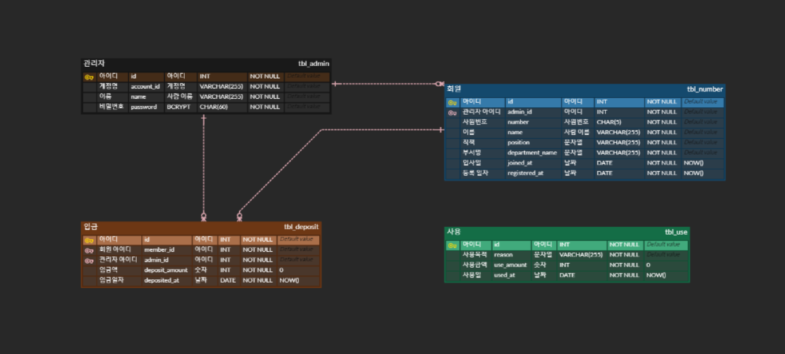

# 2022 헬프미 과제

회비 관리 시스템 과제 

<br>

## 1. 개발환경

- Java
- JDK 17
- Gradle
- JPA, MySQL
- Spring Boot 3.0.0

<br>

## 2. 설치 및 실행 방법

### 다운로드

- Github에 업로드된 프로젝트를 clone 받기 위해 git이 자신의 local에 설치되어 있어야 합니다.

```
$ git clone https://github.com/jaemin05/helpme-assignment.git
```

### 빌드

- Gradle이 자신의 local에 미리 설치되어 있어야 합니다.

```
$ ./gradlew build
```

### 실행

- 아래의 명령어를 실행하기 전에 MySQL Database를 자신의 local에 미리 실행시키고 `CREATE DATABASE helpme` SQL문을 통해 스키마를 생성합니다.
- application.yml 파일에서 `DB_USERNAME`과 `DB_PASSWORD`, `DB_URL`을 자신의 Database에 맞게 수정해야 합니다.

```
$ ./gradlew bootRun
```

### 실행 확인

- 자신의 브라우저에 [http://localhost:8080](http://localhost:8080)을 이용해 API를 사용하면 됩니다.

<br>

## 3. ERD

ERD는 `erd cloud` 툴을 활용하여 제작하였습니다.



### 기본키 구성

- `tbl_admin`, `tbl_member`, `tbl_deposit`, `tbl_use`의 PK -> **Auto Increment**

### 연관 관계

- `tbl_admin` - `tbl_member` => 1 to N
- `tbl_admin` - `tbl_deposit` => 1 to N
- `tbl_member` - `tbl_deposit` => 1 to N

<br>

## 4. API 명세서

> API 명세서는 [이곳](https://documenter.getpostman.com/view/20747414/2s8YzTU36J)에서 확인할 수 있습니다.
>
> * Postman을 활용하여 가독성이 좋고, 쉽게 테스트할 수 있는 환경이 마련되어 있습니다.

- Example Request 부분에서 SUCCESS 케이스 외에 FAILED 케이스 또한 확인할 수 있습니다.
- curl 명령어를 비롯하여 다양한 언어로 직접 요청을 보내 확인할 수 있습니다. (서버를 실행해야 요청이 가능합니다.)

<br>

## 5. Trouble Shooting

과제를 진행하며 마주한 문제들에 대해 기록합니다.

#### Excel 다운로드시 시간이 이상하게 저장되는 이슈

- 먼저, Excel을 다운로드하기 위해 `build.gradle`에`org.apache.poi:poi:5.2.2`과 `org.apache.poi:poi-ooxml:5.2.2` Excel 관련 의존성을 추가하였습니다.
- 하지만 다운로드시 기간이 저장한 숫자와 다르게 저장되었습니다.

> 기간은 LocalDate 타입으로 저장되어 있습니다. Excel로 저장하려면 값을 String 타입으로 변환해야 합니다. 그때 강제형변환을 사용하면 값이 저장한 것과 다르게 출력된다는 것을 알 수 있었습니다.
>
> ➡️ 따라서 LocalDate의 내장함수를 이용해서 년,월,일을 각 각 구해 String 타입으로 합쳐 해결하였습니다.

#### JPAQueryFactory에서 EntityManager를 인식하지 못하는 이슈

- 먼저, Spring Boot 2.7.3에서는 `build.gradle`에 `com.querydsl:querydsl-jpa` Querydsl 관련 의존성을 추가하였습니다.
- 하지만 Spring Boot 3.0.0에서는 해당 의존성이 적용되지 않았습니다.

> Spring Boot 3.0.0에서 Querydsl을 사용하려면 `com.querydsl:querydsl-jpa:5.0.0:jakarta` 의존성을 추가해야 하는 것을 알 수 있었습니다.
>
> ➡️ 따라서 `build.gradle`에 `com.querydsl:querydsl-jpa`이 아닌 `com.querydsl:querydsl-jpa:5.0.0:jakarta` 의존성을 추가하여 해결하였였습니다.
